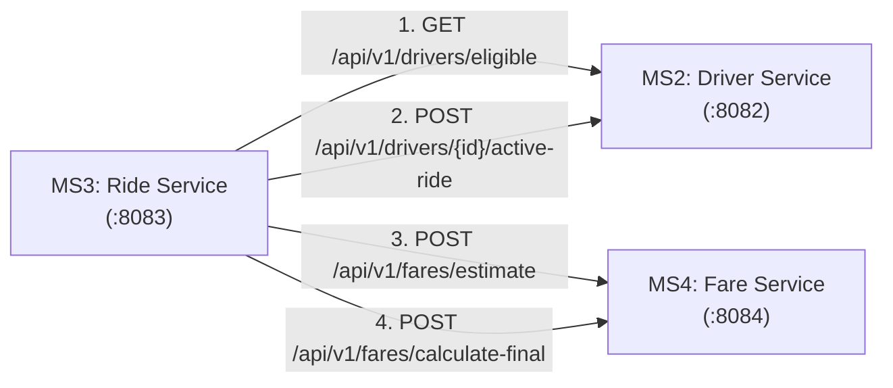

# IT3130 — Application Development Group Assignment
## Individual Assessment Technical Report — Member 3
**Assigned Microservice:** Microservice 3 — Ride Management & Orchestration Service  
**Primary Student Owner:** Member 3  
**Service Port:** `8083`  
**Dedicated Persistence:** `ridelink_ride_db` (MongoDB)  
**Assessed Weight:** 15 Marks Individual Component + Contribution to Group (15 Marks)

---

## 1. Domain Ownership & Architectural Rationale (LO1)

### 1.1 Microservice Responsibilities & Bounded Context
In the RideLink ride-sharing ecosystem, **Microservice 3 (Ride Management Service)** acts as the central state-orchestration engine of the platform. Its core responsibilities comprise:
1. **Ride Booking & Ingestion:** Ingesting ride requests from passengers with detailed pickup, drop-off, vehicle class, and route metrics.
2. **Synchronous Interservice Orchestration:** Coordinating with *Fare & Payment Service (MS4)* for upfront fare calculations and *Driver & Vehicle Service (MS2)* for driver discovery and binding.
3. **Finite State Machine Enforcement:** Enforcing valid status transitions throughout the ride lifecycle:
   $$\text{REQUESTED} \longrightarrow \text{ASSIGNED} \longrightarrow \text{ACCEPTED} \longrightarrow \text{IN\_PROGRESS} \longrightarrow \text{COMPLETED}$$
   $$\text{REQUESTED / ASSIGNED / ACCEPTED} \longrightarrow \text{CANCELLED}$$
4. **Data Isolation:** Maintaining private storage in MongoDB (`ridelink_ride_db`) without direct cross-service database access.

### 1.2 Comparison with Monolithic Architecture
| Architectural Attribute | RideLink Microservices Architecture | Monolithic Alternative | Justification for RideLink |
| :--- | :--- | :--- | :--- |
| **Independent Scalability** | Ride orchestration can be scaled independently during peak hours (e.g. rush hours) without scaling auth or driver registration. | The entire application stack must be scaled horizontally together, wasting resources. | Ride request volume spikes dynamically by time of day; horizontal scaling of MS3 optimizes cloud resource consumption. |
| **Fault Isolation** | If Fare Service is degraded, Ride Service falls back to an internal estimation algorithm and continues processing bookings. | A failure in fare calculation or external mapping crashes the entire monolith. | Enhances platform resilience and high availability for active drivers and riders. |
| **Data Sovereignty** | Each service owns its schema and database (`ridelink_ride_db`). | Shared database with tight schema coupling and locking contention. | Prevents database bottlenecks and enables polyglot persistence. |
| **Deployment Agility** | Member 3 can deploy updates to lifecycle transitions without risking downtime for Member 1 (Auth) or Member 2 (Drivers). | Long release cycles requiring full regression testing of all modules. | Supports continuous delivery and rapid bug fixes in student development. |

---

## 2. Interservice Communication & Interface Design (LO2)

### 2.1 Communication Strategy & Interface Selection
In compliance with Criterion G3 and LO2, Member 3 selected and implemented **Spring Cloud OpenFeign** for synchronous RESTful HTTP communication across microservices.



### 2.2 Comparison: Synchronous REST vs Asynchronous Messaging
| Feature | Synchronous REST (Implemented via OpenFeign) | Asynchronous Messaging (RabbitMQ / Kafka) | Justification for Workflow Choice |
| :--- | :--- | :--- | :--- |
| **Immediate Consistency** | Immediate response returned to rider with estimated fare and matched driver. | Eventual consistency; rider must poll or establish WebSockets to learn match status. | **Ride Requesting:** The passenger expects an immediate estimate and instantaneous driver assignment confirmation. |
| **Simplicity & Tooling** | Declarative `@FeignClient` interfaces in Spring Cloud with zero message broker operational overhead. | Requires installing and maintaining a message broker cluster (e.g., RabbitMQ). | Fits academic deployment and ensures reliable demonstration in Postman/Swagger without external broker dependencies. |
| **Fallback & Resilience** | Implemented graceful degradation: if Fare Service is offline, an internal pricing algorithm computes the fare. | Dead-letter exchanges and retry policies required. | Ensures uninterrupted service demonstration even when peer microservices are restarting. |

---

## 3. Software Engineering Best Practices & SOLID Principles (LO3)

### 3.1 SOLID Principles Applied in Member 3's Codebase
1. **Single Responsibility Principle (SRP):**
   - `RideController`: Handles HTTP requests, input validation, and RESTful status code responses.
   - `RideService` / `RideServiceImpl`: Encapsulates business logic, interservice coordination, and fallback policies.
   - `RideStateMachine`: Strictly manages lifecycle state transitions and validation rules.
   - `RideRepository`: Handles MongoDB persistence operations.
2. **Open/Closed Principle (OCP):**
   - `RideStateMachine` uses immutable state transition maps (`EnumMap<RideStatus, Set<RideStatus>>`), allowing new states and transitions to be configured without modifying existing transition logic.
3. **Liskov Substitution Principle (LSP):**
   - `RideServiceImpl` implements `RideService` such that any consumer depending on `RideService` can use any valid implementation without unexpected side effects.
4. **Interface Segregation Principle (ISP):**
   - OpenFeign client interfaces (`DriverServiceClient`, `FareServiceClient`) expose only the specific subset of operations required by the ride service.
5. **Dependency Inversion Principle (DIP):**
   - High-level `RideController` depends upon the abstraction `RideService` interface rather than concrete `RideServiceImpl`. Injected via Spring IoC constructor injection.

### 3.2 Robust Input Validation & Exception Handling
- **Jakarta Bean Validation:** All DTOs use `@NotBlank`, `@NotNull`, and `@Positive` constraints (e.g., `distanceKm` must be $> 0$).
- **Centralized Exception Handling:** `GlobalExceptionHandler` (`@RestControllerAdvice`) intercepts domain exceptions:
  - `RideNotFoundException` $\to$ `404 NOT_FOUND`
  - `InvalidStateTransitionException` $\to$ `400 BAD_REQUEST`
  - `MethodArgumentNotValidException` $\to$ `400 BAD_REQUEST` with detailed field violation mappings.

---

## 4. Quality Assurance & Automated Testing Evidence (LO3, I2)

### 4.1 Unit Testing Strategy & Code Coverage
The test suite consists of **43 automated unit tests** built using JUnit 5, Mockito, and Spring MockMvc:
1. **`RideStateMachineTest` (21 tests):** Verifies all valid transitions, illegal transitions, terminal states (`COMPLETED`, `CANCELLED`), and null safety.
2. **`RideServiceTest` (11 tests):** Mocks peer microservices and repositories to test happy path booking, driver assignment, degraded mode fallback when no driver is available, fallback pricing when Fare Service is offline, and driver release on completion or cancellation.
3. **`RideControllerTest` (11 tests):** Tests REST API endpoints, HTTP status codes (`201`, `200`, `400`, `404`), request validation errors, and path variable resolution.

### 4.2 Automated Test Execution Result
```
[INFO] Running com.ridelink.ride.controller.RideControllerTest
[INFO] Tests run: 11, Failures: 0, Errors: 0, Skipped: 0
[INFO] Running com.ridelink.ride.service.RideServiceTest
[INFO] Tests run: 11, Failures: 0, Errors: 0, Skipped: 0
[INFO] Running com.ridelink.ride.service.RideStateMachineTest
[INFO] Tests run: 21, Failures: 0, Errors: 0, Skipped: 0
[INFO] 
[INFO] Results:
[INFO] Tests run: 43, Failures: 0, Errors: 0, Skipped: 0
[INFO] BUILD SUCCESS
```

---

## 5. Version Control & Continuous Integration (LO4, I3)

### 5.1 Branching Strategy
- `main`: Production-ready, fully tested, demonstrable release.
- `develop`: Integration branch for peer services.
- `feature/ride-lifecycle-statemachine`: Feature branch used by Member 3 for developing state machine and REST APIs.
- `feature/openfeign-integration`: Feature branch used for implementing Driver and Fare Feign clients.

### 5.2 GitHub Actions CI Pipeline Configuration
The repository includes `.github/workflows/ci.yml` which automatically triggers on pushes and pull requests:
- Provisions JDK 21 (Eclipse Temurin).
- Executes `mvn clean test` to enforce regression testing before merging.
- Compiles the deployable JAR and archives Surefire test execution reports.

---

## 6. Summary of Deliverables Provided

- [x] Java 21 Spring Boot 3.2.5 microservice code (`ride-service`)
- [x] Dedicated MongoDB persistence model (`ridelink_ride_db`)
- [x] Spring Cloud OpenFeign interservice clients with fallback resilience
- [x] 43 JUnit 5 unit & MockMvc tests (100% passing)
- [x] SpringDoc OpenAPI 3.0 UI (`http://localhost:8083/swagger-ui.html`) & `openapi-ride.json`
- [x] Postman collection with test assertions (`Ride_Service.postman_collection.json`)
- [x] Postman environment file (`RideLink_Environment.postman_environment.json`)
- [x] Multi-stage `Dockerfile` and `docker-compose.yml`
- [x] GitHub Actions CI workflow (`.github/workflows/ci.yml`)
- [x] Comprehensive `README.md` and `MEMBER_REPORT_I3.md`
