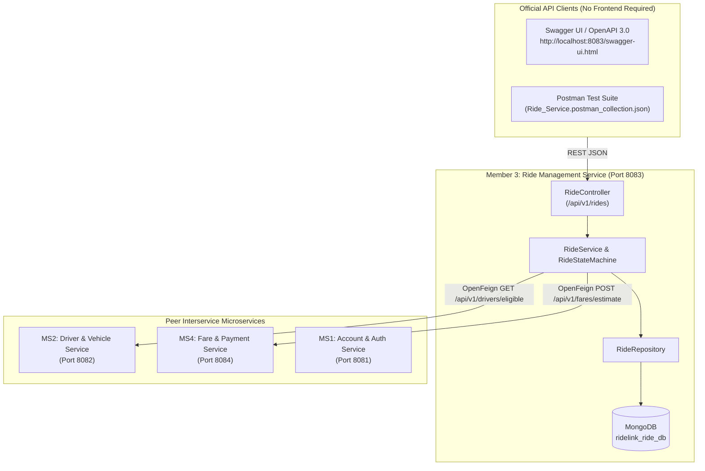
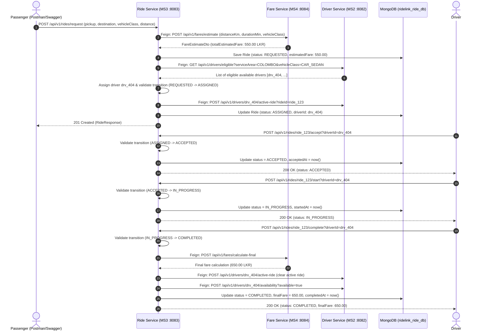

# RideLink — Ride Management & Orchestration Microservice (Member 3)

[](https://openjdk.org/projects/jdk/21/)
[](https://spring.io/projects/spring-boot)
[](https://spring.io/projects/spring-cloud)
[](https://www.mongodb.com/)
[-lightgrey.svg)]()

---

## 1. Project Overview & Domain Ownership

**Module:** IT3130 — Application Development (Group Assignment — 30%)  
**Platform:** RideLink Backend Microservices for a Ride-Sharing Platform  
**Assigned Service:** Microservice 3 — Ride Management & Orchestration Service  
**Primary Owner:** **Member 3**  
**Evaluation Criteria:** Criterion I1 (6 marks), I2 (3 marks), I3 (3 marks), I4 (3 marks), Group (15 marks)  
**Assigned Port:** `8083`  
**Dedicated Database:** `ridelink_ride_db` (MongoDB)

### Service Scope & Responsibilities (Member 3)
1. **Ride Request Creation & Dispatching:** Validates rider requests, coordinates upfront fare estimation, and stores booking data.
2. **Synchronous Interservice Communication (Spring Cloud OpenFeign):**
   - **Interaction 1:** Communicates with *Fare & Payment Service (MS4)* on port `8084` to retrieve distance-and-duration-based fare calculations.
   - **Interaction 2:** Communicates with *Driver & Vehicle Service (MS2)* on port `8082` to search eligible available drivers and update their active ride status.
3. **Ride Lifecycle State Machine:** Enforces strict transition rules across all lifecycle states:
   $$\text{REQUESTED} \longrightarrow \text{ASSIGNED} \longrightarrow \text{ACCEPTED} \longrightarrow \text{IN\_PROGRESS} \longrightarrow \text{COMPLETED}$$
   $$\text{REQUESTED / ASSIGNED / ACCEPTED} \longrightarrow \text{CANCELLED}$$
4. **Data Isolation & Persistence:** Fully isolated MongoDB persistence boundary (`ridelink_ride_db`), preventing cross-service direct DB access.
5. **Quality Assurance & Testing:** Comprehensive unit tests (43+ automated test cases) and automated Postman test scenarios.

---

## 2. Architecture & Workflow Diagrams

### 2.1 Microservices Architecture & Data Boundaries


### 2.2 End-to-End Ride Creation & Lifecycle Sequence Diagram


---

## 3. Technology Stack & Prerequisites

### Technology Requirements Met:
- **Language:** Java 21 LTS (`<java.version>21</java.version>`)
- **Framework:** Spring Boot 3.2.5
- **Data Persistence:** Spring Data MongoDB (Dedicated `ridelink_ride_db`)
- **Interservice Communication:** Spring Cloud OpenFeign 2023.0.1
- **API Documentation:** SpringDoc OpenAPI 2.3.0 / Swagger UI
- **Testing:** JUnit 5, Mockito, AssertJ, Spring MockMvc
- **CI/CD:** GitHub Actions workflow with JDK 21 Temurin
- **Containerization:** Multi-stage Dockerfile and Docker Compose

---

## 4. How to Build, Test & Run

### 4.1 Run Standalone with Maven
```bash
cd ride-service
mvn clean compile
mvn test
mvn spring-boot:run
```
The application will launch on **http://localhost:8083**.

### 4.2 Run with Docker & Docker Compose
```bash
cd ride-service
docker compose up --build -d
```

---

## 5. API Documentation & Swagger UI

- **Swagger UI Interactive Console:** 👉 [http://localhost:8083/swagger-ui.html](http://localhost:8083/swagger-ui.html)
- **Raw OpenAPI 3.0 JSON Spec:** 👉 [http://localhost:8083/v3/api-docs](http://localhost:8083/v3/api-docs)
- **Spring Boot Health Actuator:** 👉 [http://localhost:8083/actuator/health](http://localhost:8083/actuator/health)

---

## 6. API Endpoints Reference (Member 3)

| HTTP Method | Endpoint Path | Description | Expected Status |
| :--- | :--- | :--- | :--- |
| `POST` | `/api/v1/rides/request` | Create ride request, get fare estimate, match driver | `201 Created` |
| `POST` | `/api/v1/rides` | Alias: Create ride request | `201 Created` |
| `GET` | `/api/v1/rides/{id}` | Get ride details by ID | `200 OK` / `404 Not Found` |
| `GET` | `/api/v1/rides` | List all rides (optional `?status=` filter) | `200 OK` |
| `GET` | `/api/v1/rides/passenger/{passengerId}` | List rides for specific passenger | `200 OK` |
| `GET` | `/api/v1/rides/rider/{riderId}` | Alias for passenger rides list | `200 OK` |
| `GET` | `/api/v1/rides/driver/{driverId}` | List rides assigned to driver | `200 OK` |
| `POST` | `/api/v1/rides/{id}/assign-driver` | Explicitly assign driver to ride | `200 OK` |
| `POST` | `/api/v1/rides/{id}/accept` | Driver accepts assigned ride | `200 OK` |
| `POST` | `/api/v1/rides/{id}/start` | Driver starts the trip (`IN_PROGRESS`) | `200 OK` |
| `POST` | `/api/v1/rides/{id}/complete` | Driver completes trip (`COMPLETED`) & releases driver | `200 OK` |
| `POST` | `/api/v1/rides/{id}/cancel` | Cancel ride with documented reason | `200 OK` / `400 Bad Request` |
| `PUT` | `/api/v1/rides/{id}/status` | Generic status update endpoint | `200 OK` / `400 Bad Request` |

---

## 7. Postman Test Collection & Automated Assertions

Import the provided files into Postman:
- Collection: `ride-service/postman/Ride_Service.postman_collection.json`
- Environment: `ride-service/postman/RideLink_Environment.postman_environment.json`
